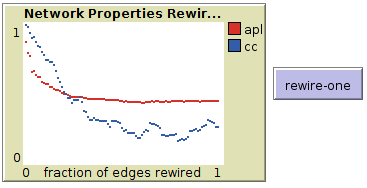

# Assignment 4: Networks over time
Geleta Firdissa

## Introduction
This lab shows dynamic networks or netowrks that change over time. This includes community detection, network of email communications, bridges and temporal analysis.

## Methods
Temporal networks are networks which are visualized as things change over time. The dataset we have is email statistics.
I tried installing snappy but it seems to be not working on my machine because it does not support 32 bit architectures and on the other hand requires python 2.7.x But I have gephi so I will proceed with that.

To import the data sets into gephi first I had to convert the .txt to .csv and import as spreadsheet because gephi does not support text files. 
I added source, target and time to the data.
After I imported the data, I used the data laboratory to merge column and create a time interval timeline. With the unixts becoming dynamic I exported the data and evaluated its plot.

## Results
Email EU core temporal data

Statistical output based on adjacency list
#Nodes = 208865
#Edges = 664668

Average Degree = 1.122
Average Weighted Degree = 3.182

Statistical output when the data is based on edge table and time slot is identified

#Nodes = 986
#Edges = 332334

Average Degree = 25.283
Average Weighted Degree = 337.053
Diameter = 7
Average Path length = 2.653
Average clustering coefficient = 0.352
Graph Density 0.026

(* I did not include snapshot before temporal analysis to reduce size)
Image after temporal analysis

Generally the graph shows that as new edges are formed, the time to connect them interval kept increasing. I noticed this by looking at the edge table and arranging by time interval, the latest IDS are at the top. 

To do step 4, I removed the edges after the specified times and created 3 separate graphs. The result is as follows

Snapshot of table at 12,096,000

at 18,144,000

at 24,192,000

## Discussion

"Bridge networks transmit information from one group to another. The breadth of information spread depends heavily on the number and connectedness of the bridges available to the originators of the information." - Wikipedia

To answer the question that bridge people are either more or less efficient on email communication depends on various factors and there could hardly be a straight forward answer. Depending on the type of ties, the use of the email communication type, the category the communities exist in etc.. 

For instance, let's take viral videos which are shared on email or through any social platform, it takes general bridges to spread such informations such as a fb page, blog or channels. In case of emails, such activities are done through bridge people. Bridge people have great and direct ties between many nodes that do not know each other in any other way. This means if these bridge people are taken out of the scene, the remaining nodes would not be connected to each other. This highly contributes to their efficiency.

Most of the time, email is used for business and professional activities. An organization is connected to another organization usually, through one person (an edge) and this is the person that communicates everything to outside. 

For example, A graph component O1 represents organization and O2 represents an organization in a different country. out of all the nodes, these organizations use only n1, let's say their external relations officer and n2 to communicate with other organizations. n1 and n2 both contain a list of contacts for other similar nodes and could only access nodes that are in a different graph component. Because they do not use email to communicate to nodes that are inside their own graph. They communicate frequently. This is a characteristics of Weak Ties and this proves that n1 and n2 have bi-directional communication and are very efficient in this case, to connect organizations. 

In the other scenario, we could take political information through email. These communications are risky and could sustain only strong ties and it is harder to divulge information to external body. 

Therefore, my conclusion would be that in the cases where weak ties do form such as employees creating weak ties to bring in relevant info for their company, bridge people are significantly efficient at email communication. Weak ties are very important for professional activities, organizations and even research institutions. Sometimes more valuable than the strong ties.

## Conclusion

Previously, we have learned about static visualization of data from email. This time, I had the chance to learn about temporal networks. This lab helped me to learn about bridges, how they influence communication and temporal analysis. The concept of temporal networks and how a network can be visualized and statistically reviewed in a specific time frame is one of the things I got familiar with in this assignment.