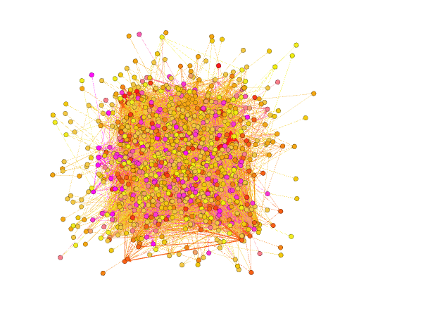

# Assignment 4: Networks over time
Mintesnot Melesse


## Introduction
In Networks over time the unique part is the dynamic appearance and disappearance nodes and edges plus the evolution of aggreagte metrics in the network.

## Methods
Firstly I named the columns of the raw ```email-Eu-core``` file to, Source, Target and Time respectively and saved the file as a .csv file then I imported the saved .csv file to Gephi to analyse the graph's statistics and also to analyse what a change it time causes to the graph and many statistical datas.

## Results
Number of weakly connected components = 1

Number of strongly connected components = 184

Average degree = 25.283

Average weighted degree = 337.053

Network diameter = 7

Graph density = 0.026

Modularity = 0.287

Average clustering coefficient = 0.352

Average path length = 2.653

Mean = 208.996

### The original graph




#### starting at time 12,096,000 (20 weeks)


#### at time 18,144,000 (30 weeks)


#### at time 24,192,000 (40 weeks)


## Discussion
To the answer the question "A "bridge" person in an organization connects many different people. Are "bridge" people more efficient or less efficient at email communication?
". In my opinion the importance of bridge person decreases as the time increases because when the times increases more nodes are connected and the need for a bridge person decreses so it is less efficient.
## Conclusion
Throughout my all analysis of the above graph about Networks over time, I have learned a lot about how statistics change as time changes and aggreagte metrics of the network.