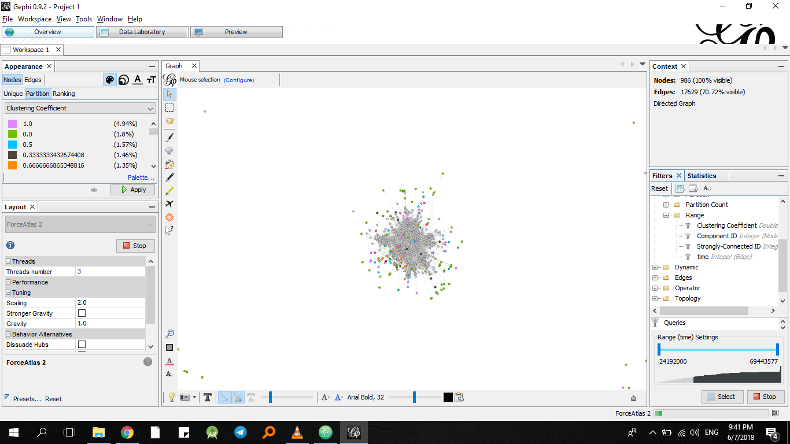

#Assignment 4: Networks over time

<Mekre> <Abate>

## Introduction

In this assignment we see whether bridges are the backbone of new connections and different opportunities. We see that not only are they a benefit when they occur but that we should take the initiative to find them and utilize them to our advantage. No matter the situation we are in, bridges can be asset as we will see in the following sections.

## Methods

In this assignment I have used the "gephi" tool. I have chosen this because I have worked on it on previous assignments and have developed some amount of familiarity. In this tool we find different methods where we could see the statistics of the graph we want further study. These information are available in the statistics tab where we could run the functions to determine the clustering coefficient and the weakly and strongly connected components.

Other than that when we come to the filter section, we can filter the nodes by time as it has been imported into the file as a third parameter. By going over to the "data laboratory tab" we can select the time within the range folder under the attributes directory. With the range filter we can give it the specific time and it will produce the graph at that time, or more specifically the edges present at that time.  With this we can answer the filtering question in part 4.

To the answer the main question for this assignment, There was nothing I had referred from the dataset but used my knowledge I have gotten about bridges till now from the course.

## Results

There is 1 weakly connected component and 184 strongly connected components.

The clustering coefficient is 0.352

Network at time 12,096,000

Network at time 18,144,000

Network at time 24,192,000

For the main concern this is my answer:
Weak connections or connections out of our circle create links to worlds we aren't used to. This could mean new opportunities, new risk and or just the same thing we are used to. But one thing we are certain of is that we can never be sure of what will be on the end of that link. I believe, a bridge connection via email will be a source of new things to us, it could mean that we might face different obstacles but at end of the day it is a new door which I would personally take.

## Discussion
The different graphs generated at different times show that as we increase the starting point we can see the number of decrease. This shouldn't come as a surprise as we are taking time for the other edges to be instantiated. The clustering coefficient shows that the graph's node's neighbors are well connected. This can also be seen in the huge number of the amount of strongly connected components. Having a high number of this will mean that there is a lot of segregation between different groups and weak links will be the ones responsible for holding this link.

Talking about the amount of components in the graph made me realize why the weak links are important in this graph. I thought I wouldn't be answering this question from this graphs perspective but here is my understanding. As there are a huge number of connected components in the graph it would be up to the weak links, i.e the email bridges to connect this components. As the different segregations occur within this organization, the components(the groups of people that seem to stick together) wouldn't have been part of the same graph, they would have been in different graphs. Therefore we can say weak links are important to connect the components and make the email happen between the different groups of people.

## Conclusion

In conclusion I understand now that weak links are the small , underappreciated phenomena that keep this world turning. Thanks to them different societies can learn from each other and grow to different heights. Connections like these may not go unnoticed but should be realized as much as possible with different mechanisms. Because I think the more we understand this, the more we can connect with the world. I know my conclusion doesn't match with the technical matter but I wanted to conclude on something meaningful and profound and yet somehow relate with the given topic than just state a bunch of numbers again and try to create the relation.
