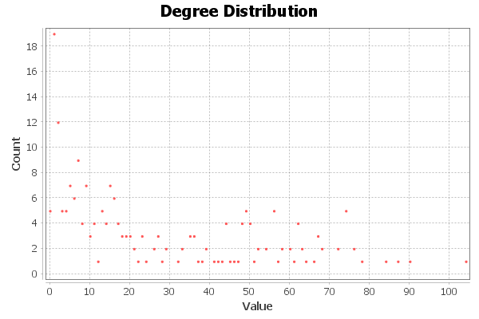
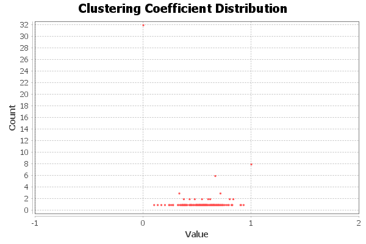
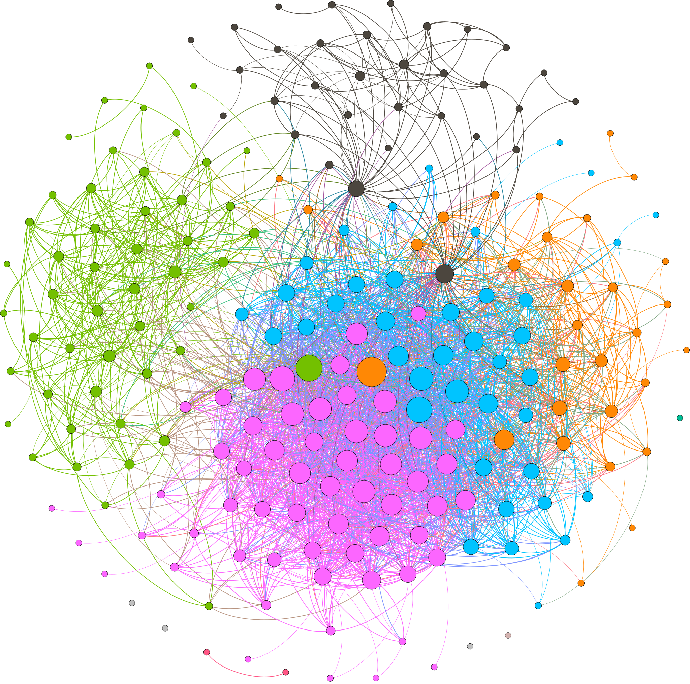

# Introduction

> We did this lab to help us understand the matrices and formulas we have learnt in class by visualizing and analyzing our social network connection. For this exercise we chose Facebook and it was very ingesting to see the various statistics you can pull out from the graph. In this project I have seen the use of, node degrees, average node degrees, connectedness, clustering coefficient and other theories and also how they are formulated and utilized to solve problems.

# Methods

- > ### Q 1 
> The way to calculate the percentage of how many of my friends are connected is by calculating 'connectance'. This will give me a constant number which can help identify if my graph is sparse or dense. And the connectance of my graph is 0.123, furthermore the number of connected components is 7.

- > ### Q2
> To find the person who has the most friends in common with me I used 'node degree'. I went into the data laboratory tab and sorted the table by degree, which showed me who had the most number of connections. Biruk Teferi (104).

- > ### Q3 
> The average number of friends may Facebook friends have is calculated by 'average node degree'. 26.472 is the number. And looking at the degree distribution graph we can see that most of the dots are focused around 20~30.

- > ### Q4
> The answer for this particular question was very tricky to find. The 'clustering coefficient ' is what I used to get how close or far my friends were. The number that came up was 0.548. This shows how well connected each node is to the others.

- > ### Q5 
> For this question the answer would be 2.395, which is the average path length between the nodes of my graph. The 'average path length' shows the number of steps between nodes and thus showing how close or far my friends are. And since the number is close to one, I can assume that they are close.

> The most difficult part of this assignment was selecting one metric from the different methods provided to use for each question. Sometimes the metric that was used for one question also seemed to be applicable for the others.

# Results

> The colors represent different groups in the graph. The dark gray nodes are my family (brother, sister, cousins). The green colored nodes are my friends from this class and close friends from the university. The orange nodes are friends from this university that Im not that close with. Finally, the pink nodes are all my friends (class mates) from high school and the blue ones are friends from junior class from my high school.

# Discussion

> A degree of 216 shows that for this particular network my number of friends is 216. An average node degree of 26.472 portrays that on average a single friend knows 26 others in my friends list.
